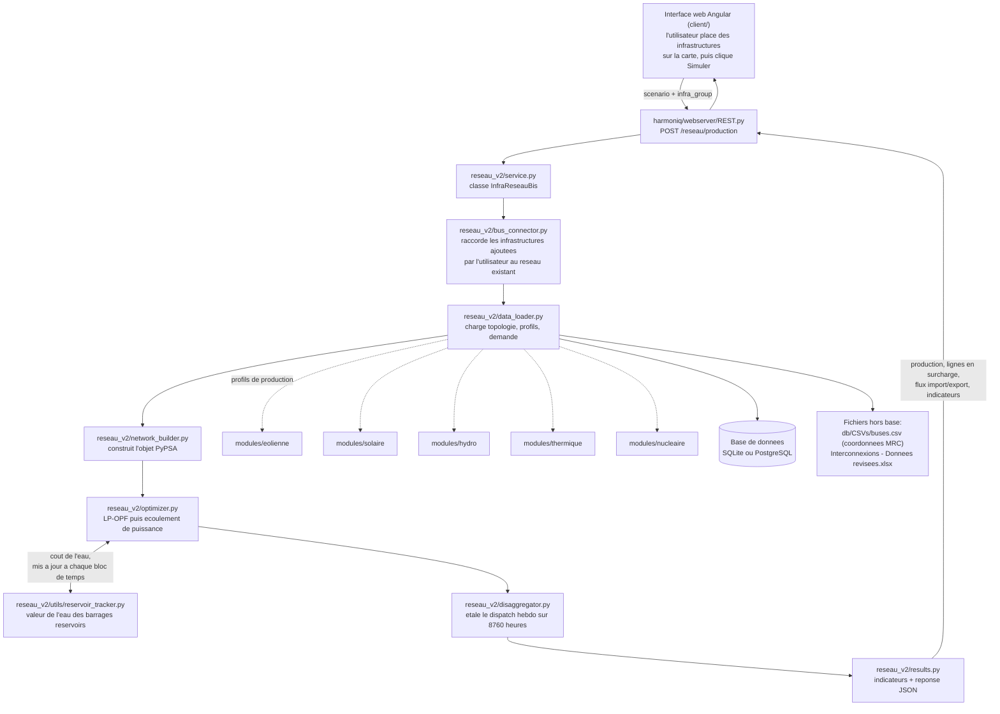

# Notes de passation — branche `feature/reseau_v2`

Ce document explique où en est la branche, comment fonctionne le module
`reseau_v2`, et comment l'intégrer proprement dans `main` plus tard. Il est
écrit pour quelqu'un qui reprend le projet sans avoir suivi son historique.

## 1. Où en est la branche

`feature/reseau_v2` contient maintenant tout ce qui est sur `main` (jusqu'au
commit `d1c07c4`, qui est la PR #172), plus le nouveau module de simulation
réseau `reseau_v2`. Il ne manque donc plus rien de `main` dans cette branche.

Comptage exact par rapport à `origin/main` : 24 commits d'avance et aucun
commit de retard. Comme la branche contient déjà l'intégralité de `main`, un
merge de la branche vers `main` serait un fast-forward : git avancerait
simplement `main` jusqu'au bout de la branche, sans aucun conflit.

Le point de départ commun entre les deux branches est le commit `0b1f9de`. Le
détail de chaque commit d'intégration (ce qu'il change et pourquoi) est dans
son propre message de commit (`git log`), pas répété ici.

Le renommage du dossier `reseau_bis` en `reseau_v2` a déjà été fait partout
(imports, tests, route REST). Les noms de classes comme `InfraReseauBis` et
`ReseauBisViz` ont volontairement été laissés tels quels, pour ne pas casser
d'éventuels scripts externes qui les utiliseraient.

## 2. Comment fonctionne `reseau_v2`

Cette section suit tout le trajet d'une simulation, depuis le clic dans
l'interface jusqu'au résultat affiché, avec le nom exact des fichiers et des
fonctions à chaque étape. Le but : que quelqu'un qui ne connaît pas le code
puisse retrouver « qui appelle qui » sans avoir à demander.

Le nouveau module vit dans `harmoniq/modules/reseau_v2/`. Il remplace l'ancien
dispatch par ordre de mérite par une vraie optimisation linéaire du placement
de production (LP-OPF, via PyPSA et le solveur HiGHS), suivie d'un écoulement
de puissance en courant alternatif. L'ancien module `reseau` reste actif en
parallèle, rien n'est retiré.

### 2.1 Vue d'ensemble

Les flèches en pointillé (`data_loader` vers les modules de production) veulent
dire : `data_loader.py` appelle les classes `InfraParcEolienne`, `InfraSolaire`,
`InfraHydro`, `InfraThermique`, `InfraNucleaire` de ces modules pour obtenir les
profils de production ; il ne réécrit pas leurs calculs, il les utilise.

### 2.2 Le trajet, étape par étape

**1. L'utilisateur, dans l'interface.** Quand il ajoute une infrastructure
(ex. une centrale thermique ou un parc solaire) et lance une simulation, le
service Angular `simulation-temporal-graph-service.ts` (méthode `generate()`)
envoie une requête `POST /reseau/production` avec deux blocs : `scenario`
(dates, pas de temps) et `infra_group` (la liste des infrastructures
sélectionnées, construite par `InfrastruturesService.buildSimulationPayload()`).

**2. Le serveur reçoit la requête.** `harmoniq/webserver/REST.py`, fonction
`calculer_production_reseau()` (ligne 370, déclarée par
`@reseau_router.post("/production")` ligne 369) : vérifie d'abord un cache
mémoire (20 entrées max, pour ne pas refaire le calcul si rien n'a changé),
puis crée un objet `InfraReseauBis(infra_group)` et l'exécute dans un thread
séparé (le calcul est long, on ne bloque pas le serveur).

**3. Construction du réseau — `InfraReseauBis.creer_reseau()`**
(`reseau_v2/service.py`, ligne 57).
   - `NetworkDataLoaderBis.load_topology_from_db()` (`data_loader.py`, ligne
     502) charge les bus et les lignes depuis la base.
   - `BusConnector.connect_new_infras()` (`bus_connector.py`, ligne 144) :
     pour chaque infrastructure ajoutée par l'utilisateur, crée un nouveau bus
     à sa position géographique et une ligne vers le bus existant le plus
     proche (distance réelle, formule de Haversine — `_process_infra()`,
     ligne 169).
   - `NetworkDataLoaderBis.load_generation_profiles()` (`data_loader.py`,
     ligne 563) récupère, pour chaque générateur, sa puissance installée
     (`p_nom`, fixe) et deux séries dans le temps : `p_max_pu` (une fraction
     entre 0 et 1 — combien de sa capacité il peut produire à cet instant) et
     `marginal_cost` (son coût en $/MWh). Le détail par filière, avec les
     unités exactes, est en 2.4.
   - `NetworkDataLoaderBis.load_demand_profile()` (`data_loader.py`, ligne
     1046) récupère la demande.
   - `network_builder.build_pypsa_network()` (`network_builder.py`, ligne
     292) assemble tout ça dans un objet `pypsa.Network` : les bus, les
     lignes (avec leurs caractéristiques électriques dérivées de leur type et
     longueur), les générateurs (`_add_generators`, ligne 676), les charges
     (uniquement sur les bus de consommation, `_add_loads_on_conso_buses`,
     ligne 705), et les liens d'interconnexion (`_add_interconnection_links`,
     ligne 759 — détail en 2.6).

**4. Calcul du dispatch — `InfraReseauBis.calculer_production()`**
(`reseau_v2/service.py`, ligne 109).
   - L'optimisation tourne **toujours** en hebdomadaire (52-53 pas de temps),
     jamais directement sur les 8760 heures de l'année — le pourquoi et le
     comment sont en 2.5.
   - `reservoir_tracker.build_reservoir_feed_data()`
     (`utils/reservoir_tracker.py`, ligne 246) calcule, avant l'optimisation,
     le coût de l'eau de chaque barrage réservoir selon son niveau de
     remplissage (départ à 95 %).
   - `optimizer.run_dispatch_and_flow()` (`optimizer.py`, ligne 45) : résout
     l'optimisation (qui produit combien, à quel coût) puis calcule les flux
     et les pertes réels sur chaque ligne. Détail en 2.7.
   - Si la résolution horaire est demandée : `disaggregator.disaggregate_to_hourly()`
     (`disaggregator.py`, ligne 32) étale le résultat hebdomadaire sur les
     8760 heures (détail en 2.5).
   - `reservoir_tracker.compute_reservoir_levels()`
     (`utils/reservoir_tracker.py`, ligne 50) calcule l'évolution du niveau de
     chaque barrage.
   - `results.extract_kpis()` (`results.py`, ligne 30) puis
     `results.format_api_response()` (`results.py`, ligne 289) calculent les
     indicateurs (énergie totale, pertes, lignes en surcharge, flux
     import/export) et formatent la réponse JSON.

**5. Le résultat revient au client**, qui l'affiche (graphique de production
par filière, carte des lignes en surcharge, etc.).

### 2.3 Le rôle de chaque fichier de `reseau_v2`

| Fichier | Rôle |
|---|---|
| `service.py` | orchestre tout le trajet ci-dessus (classe `InfraReseauBis`) |
| `data_loader.py` | charge tout depuis la base et les fichiers : topologie, profils de production, demande |
| `bus_connector.py` | raccorde au réseau les infrastructures ajoutées par l'utilisateur |
| `network_builder.py` | construit l'objet PyPSA à partir de ces données |
| `optimizer.py` | résout l'optimisation et l'écoulement de puissance, gère les cas où ça ne converge pas |
| `disaggregator.py` | étale le résultat hebdomadaire sur les 8760 heures |
| `utils/reservoir_tracker.py` | calcule la valeur de l'eau et suit le niveau des barrages |
| `results.py` | calcule les indicateurs et formate la réponse pour l'API |
| `viz.py` | tableau de bord de visualisation, optionnel, pour inspection manuelle |
| `dto.py` | structures de données partagées entre les sous-modules |

### 2.4 Ce que chaque filière envoie, précisément

`NetworkDataLoaderBis.load_generation_profiles()` (`data_loader.py`, ligne
563) retourne trois objets, identiques dans leur forme pour toutes les
filières :

- `generators` — une table statique, une ligne par générateur, colonnes
  `name`, `bus`, `carrier`, `p_nom` (**en MW**, la puissance installée, fixe
  dans le temps).
- `p_max_pu` — une table indexée par pas de temps, une colonne par
  générateur : une **fraction entre 0 et 1**, sans unité (pas de MW ici) —
  quelle part de sa capacité installée (`p_nom`) le générateur peut produire à
  cet instant. C'est cette fraction, multipliée par `p_nom`, qui donne le
  plafond de production que respecte le solveur.
- `marginal_cost` — une table indexée par pas de temps, une colonne par
  générateur : le coût en **$/MWh**.

Le calcul de `p_max_pu` se fait dans `_generate_timeseries()` (`data_loader.py`,
ligne 651), une section de code par filière. Détail, avec la valeur de repli
utilisée si la donnée réelle n'est pas disponible :

**Éolien** (`data_loader.py`, lignes 804-843, calcul délégué à
`_fetch_one_eolien_profile()`, ligne 349) — instancie `InfraParcEolienne`
(`harmoniq/modules/eolienne/`) et appelle sa méthode `calculer_production()`,
qui retourne une colonne `puissance` (en **kW**) indexée par `tempsdate`, à
partir de la vitesse du vent (réanalyse ERA5) et de la courbe de puissance de
la turbine. `data_loader.py` divise cette série par la puissance installée du
parc (`puissance_nominal` en kW/turbine × `nombre_eoliennes`, ligne 380) pour
obtenir `p_max_pu`. Traité en parallèle, un thread par parc (jusqu'à 8 en même
temps), avec un cache par parc sur disque pour éviter de rappeler ERA5 à
chaque simulation. Repli si la donnée est absente : **0,25** (25 % de la
capacité, lignes 373 et 387).

**Solaire** (`data_loader.py`, lignes 845-908) — instancie `InfraSolaire`
(`harmoniq/modules/solaire/`) et appelle `calculer_production()`, qui retourne
soit une colonne `production` (en kW), soit `production_horaire_wh` (en Wh, donc
convertie en kW en divisant par 1000 — lignes 887-888), à partir de l'irradiance
PVGIS. Diviser par la puissance crête du parc (`puissance_nominal` en
kW/panneau × `nombre_panneau`, ligne 886) donne `p_max_pu`. Repli si absent :
**0,0** (pas de valeur de repli non nulle codée pour le solaire, contrairement
aux autres filières — lignes 892 et 902).

**Nucléaire** (`data_loader.py`, lignes 910-935) — instancie `InfraNucleaire`
et appelle `calculer_production()`, colonne `production_horaire_wh`, divisée
par `puissance_nominal` (en MW) de la centrale. Repli si absent : **0,85**
(ligne 931).

**Hydro fil de l'eau** (`data_loader.py`, lignes 937-963) — pour les barrages
dont `type_barrage == "Fil de l'eau"`, instancie `InfraHydro` et appelle
`calculer_production()` (débits HydroGenerate), divisée par `puissance_nominal`
(en MW). Repli si absent : **0,6** (ligne 959). En plus de `p_max_pu`, un
`p_min_pu` est ensuite forcé dans `network_builder.build_pypsa_network()`
(lignes 370-388) à 85 % de `p_max_pu` : l'eau coule en continu et doit être
turbinée ou exportée, la centrale ne peut pas s'arrêter à volonté.

**Thermique** (`data_loader.py`, lignes 965-990) — instancie `InfraThermique`
et appelle `calculer_production()`, colonne `production_mwh` (en MW constant,
sauf pendant la semaine de maintenance de la centrale), divisée par
`puissance_nominal` (en MW).

**Hydro réservoir** — aucune des classes `InfraXxx` n'implémente de profil
pour ce type de barrage. `data_loader.py` lui attribue directement
`p_max_pu = 0,95` en dur (ligne 1000), constant. Ce qui varie dans le temps
pour cette filière n'est **pas** `p_max_pu` mais `marginal_cost` : c'est la
valeur de l'eau (2.7), recalculée à chaque bloc de temps selon le niveau réel
du barrage.

**Repli général** (`data_loader.py`, lignes 992-1008) : si un générateur
n'obtient aucune valeur par les blocs ci-dessus (échec complet de récupération
des données, pas seulement des trous), il reçoit `p_max_pu = 1.0` (disponible
à 100 %) — sauf `hydro_reservoir` (0,95, comme ci-dessus) et `hydro_fil`, qui
reçoit un profil saisonnier mensuel codé en dur (`_FIL_MONTHLY_CF`).

**Coûts marginaux** (`data_loader.py`, lignes 675-688, dictionnaire
`MARGINAL_COSTS`) : éolien 0 $/MWh, solaire 0 $/MWh, hydro fil de l'eau
0 $/MWh (les trois à coût nul, donc dispatchés en priorité), hydro réservoir
5 $/MWh de base (remplacé par la valeur de l'eau dynamique), nucléaire
0,2 $/MWh, thermique 30 $/MWh (dernier recours).

### 2.5 Le calcul hebdomadaire et la désagrégation

**Pourquoi hebdomadaire.** Résoudre l'optimisation directement sur 8760 heures
serait trop lent pour un usage interactif. `_aggregate_to_resolution()`
(`data_loader.py`, ligne 94) moyenne chaque profil (production et demande)
par semaine calendaire avant même de construire le réseau — le réseau PyPSA
est donc construit directement avec 52-53 pas de temps, pas 8760.
`run_dispatch_and_flow()` résout cette version réduite en une seconde environ.

**Comment on revient à l'heure.** Une fois le dispatch hebdomadaire connu,
`disaggregate_to_hourly()` (`disaggregator.py`, ligne 32) l'étale sur 8760
heures avec une règle simple : tous les générateurs sauf les barrages
réservoirs gardent exactement leur valeur hebdomadaire (dupliquée sur les 168
heures de la semaine) ; seuls les réservoirs varient heure par heure, pour
absorber l'écart entre la demande réelle de chaque heure et la moyenne
hebdomadaire décidée par l'optimisation, dans la limite de 95 % de leur
capacité. Si même les réservoirs ne suffisent pas à absorber l'écart, le reste
est compté comme un import supplémentaire — pas un dépassement silencieux.

### 2.6 Les interconnexions (import / export)

Pour chaque frontière (Nouveau-Brunswick, Nouvelle-Angleterre, New York,
Ontario, plus Churchill Falls au Labrador), il y a un bus interne (`IntercoN`,
connecté au réseau québécois) et un bus virtuel (`EtrangerN`, qui représente le
marché externe). `_add_interconnection_links()` (`network_builder.py`, ligne
759) crée, entre les deux :

- un lien physique (`Link` PyPSA) à capacité asymétrique — la limite d'import
  n'est pas forcément la même que celle d'export ;
- deux générateurs virtuels sur le bus étranger : un qui ne peut que produire
  (l'import, à un prix mensuel et régional — plus cher en hiver) et un qui ne
  peut qu'absorber (l'export, à un prix fixe, plus bas).

Personne ne dit au solveur d'importer ou d'exporter : il choisit lui-même, à
chaque instant, ce qui minimise le coût total. Exporter (par exemple le
surplus d'hydro fil de l'eau, qui ne peut pas être stocké) devient une source
de revenu dans son calcul plutôt qu'un coût, ce qui l'incite à vendre le
surplus au lieu de le perdre.

Ces capacités (import/export en MW, différentes par frontière) viennent
aujourd'hui d'un fichier Excel lu directement à l'exécution
(`_load_interco_capacities()`, `network_builder.py`, ligne 729), pas de la
base — détail et correctif proposé à la section 8.

### 2.7 Si ça ne converge pas — la cascade de secours

`_run_dispatch_with_fallback()` (`optimizer.py`, ligne 102, appelée par
`run_dispatch_and_flow()`, ligne 45) :

1. Essaie l'optimisation avec les vraies limites (lignes et interconnexions).
2. Si ça échoue : relâche les limites thermiques des lignes (elles
   redeviennent non contraignantes) et essaie, dans l'ordre, de desserrer les
   capacités d'export, puis d'import, puis les deux ensemble — en s'arrêtant
   dès qu'une combinaison fait converger l'optimisation.
3. Si rien ne fonctionne, l'état d'origine est restauré et la simulation
   retourne quand même un résultat, marqué comme non optimal.

Une fois le dispatch obtenu, `_run_power_flow()` (`optimizer.py`, ligne 566)
calcule les flux réels : il essaie d'abord un écoulement de puissance
alternatif complet (Newton-Raphson), et se replie automatiquement sur un
calcul linéarisé (plus simple mais toujours convergent) si le réseau
alternatif ne converge pas — ce qui arrive typiquement quand des bus
étrangers, connectés seulement par des liens et pas par de vraies lignes,
créent des sous-réseaux déconnectés.

Chaque relâchement de contrainte est journalisé et remonté dans la réponse API
(`was_relaxed`, `constraint_warnings`), pour qu'on sache qu'un résultat vient
d'un cas dégradé plutôt qu'une simulation normale.

## 3. Ce que la fusion de `main` a apporté dans la branche

- **Base de données SQLite ou PostgreSQL.** Le fichier `db/engine.py` choisit le
  moteur au démarrage : base SQLite en mémoire quand les tests tournent
  (`HARMONIQ_TESTING`), fichier SQLite si `HARMONIQ_DB=sqlite`, sinon PostgreSQL,
  qui est le nouveau choix par défaut. Sous PostgreSQL, toutes les tables sont
  regroupées dans un schéma SQL nommé `reseau` (un espace de noms dans la base,
  comme un dossier ; par défaut on serait dans `public`). Le code s'y adresse en
  préfixant les tables : `reseau.bus` au lieu de `bus`. SQLite n'ayant pas de
  schémas, `engine.py` retire ce préfixe à la volée pour SQLite. Nouveaux
  fichiers : `db/demande_sqlite.py`, `scripts/install_postgres.py`,
  `scripts/sync_db.py`.
- **Scripts.** Les commandes `init_database.py`, `load_database.py` et
  `lance_webserver.py` acceptent maintenant `--sqlite`, `--postgre` et `--reset`.
  Les scripts liés à l'éolien ont été regroupés sous `scripts/eolien/`. Le script
  `scripts/add_indexes.py` a été supprimé.
- **Docker.** Ajout de `docker-compose.yml`, des `Dockerfile` (serveur, client,
  base), de `client/nginx.conf`, de `harmoniQ/.env` et de `pyrefly.toml`. Cela
  permet de lancer toute la pile (base + serveur + client) en une commande, pour
  le déploiement. Ce n'est pas nécessaire pour travailler en local.
- **Dépendances** (`pyproject.toml`) : ajout de `psycopg2`, `python-dotenv` et
  `email-validator`.
- **Frontend et documentation** : modifications de `map-service.ts`,
  `create-infra-modal`, `home-page.ts`, des fichiers d'environnement Angular et de
  plusieurs fichiers `.spec.ts`, ainsi que de `README.md`, `GUIDE_DEVELOPPEUR.md`
  et `SCRIPTS.md`.

## 4. Les conflits de la fusion et comment ils ont été résolus

Un seul conflit a demandé une résolution manuelle : `.gitignore`. On a gardé la
ligne `**/harmoniq.sql` venant de `main` et retiré le bloc qui ignorait
l'outillage de génération de documents personnels, puisque cet outillage a été
sorti du dépôt.

Deux fichiers importants se sont fusionnés automatiquement, et le résultat a été
vérifié à la main :

- `db/schemas.py` : la version de `main` apporte le schéma `reseau`, le type
  `BigInteger` pour `volume_reservoir` et des clés étrangères en `String` ; la
  version de la branche apporte la colonne `nb_ligne` sur `Line` et les champs
  Pydantic `is_user_created`, `type_intrant` et `surface_roughness_z0_m`. Les deux
  ensembles de changements sont présents dans le fichier final.
- `scripts/init_database.py` : la version de `main` apporte les options
  `--sqlite / --postgre / --reset` et la création de l'utilisateur et de la base
  PostgreSQL ; la version de la branche apporte la lecture des CSV
  `bus_db_03_26.csv` et `lines_db_03_26.csv` (séparateur `;`, décimale `,`) et la
  colonne `nb_ligne`. Là aussi, tout est présent.

Les fichiers `db/engine.py`, `db/demande.py`, `scripts/load_database.py` et
`webserver/__init__.py` n'avaient pas été modifiés par la branche : ils ont donc
été pris tels quels depuis `main`.

## 5. Le point de vigilance principal

Le module `reseau_v2` a été écrit et testé avec SQLite. Depuis la fusion, les
tables sont dans le schéma `reseau`. Le retrait automatique du préfixe rend ça
transparent dans le cas général, mais tout code qui ouvre sa propre connexion à
la base, en dehors de `db/engine.py`, doit y penser : `schema_translate_map` pour
SQLite, ou le bon `search_path` pour PostgreSQL. Avant une mise en production, il
faut faire tourner le module contre une vraie base PostgreSQL pour confirmer que
tout passe.

## 6. Comment lancer les tests

Les tests unitaires du module sont dans `tests/unit/` (comme ceux de l'ancien
module réseau) :

    pytest tests/unit/test_reseau_v2_dispatch_minimal.py
    pytest tests/unit/test_reseau_v2_bilan_energetique.py

Ils sont rapides et n'ont besoin d'aucune base : tout est monté en mémoire.

Le test qui vérifie le pipeline complet contre la vraie base de topologie est
dans `tests/` :

    pytest tests/test_reseau_v2_pipeline_db.py

Celui-là a besoin du fichier `harmoniq/db/db.sqlite`, construit par
`init-db -p --sqlite`. S'il est absent (cas de la CI), le fichier est ignoré au
lieu de faire échouer la suite.

Enfin, `harmoniq/scripts/diagnostic_reseau_v2.py` n'est pas un test : c'est un
outil de vérification manuelle qui lance une simulation complète et imprime un
rapport. On le lance avec
`python -m harmoniq.scripts.diagnostic_reseau_v2 --scenario_id <id>` (il faut une
base peuplée avec au moins un scénario et `HARMONIQ_DB=sqlite`).

Dernier état vérifié en local, avec le venv en Python 3.11 : les tests du module
passent (21 au total avec `test_installation`), et une simulation réseau
complète fonctionne de bout en bout en SQLite depuis l'interface. Non vérifiés :
les tests unitaires du frontend (`npm test`) et un passage complet de
`diagnostic_reseau_v2.py` (qui demande une base avec des scénarios).

## 7. Plan d'intégration vers `main`

### Pourquoi ne pas tout fusionner d'un coup

Git le permettrait sans conflit (voir section 1), mais un seul merge ferait
tomber dans `main` environ 8000 lignes d'un bloc : un module sensible au schéma
de base et des changements frontend. C'est difficile à relire et difficile
d'annuler un seul morceau si quelque chose se comporte mal en production. On
préfère donc découper.

### La méthode

Bonne nouvelle : presque aucune retouche manuelle. Tous les fichiers backend qui
existent déjà sur `main` (`REST.py`, `schemas.py`, `init_database.py`,
`hydro/calcule.py`) ne diffèrent de `main` que par du `reseau_v2`, rien d'autre
ne s'y est glissé. On peut donc **remplacer chaque fichier par la version de la
branche**, sans trier.

Pour chaque pull request, le schéma est toujours le même :

    git checkout main
    git pull
    git checkout -b integ-reseau-etape1

    # remplacer un fichier, ou amener un dossier / un fichier neuf,
    # par la version telle qu'elle est sur la branche
    git checkout feature/reseau_v2 -- harmoniQ/harmoniq/db/schemas.py
    git checkout feature/reseau_v2 -- harmoniQ/harmoniq/modules/reseau_v2/

    git commit -m "..."
    # puis push et ouverture de la pull request

`git checkout <branche> -- <chemin>` copie le contenu de ce chemin depuis la
branche indiquée, sans rejouer ses commits (l'historique de `feature/reseau_v2`
mélange plusieurs sujets dans un même commit, on ne s'en sert pas).

### Les étapes, dans l'ordre

Chaque étape laisse `main` dans un état fonctionnel.

1. **Préparation base et correctifs.** Remplacer par la version de la branche :
   `harmoniq/modules/hydro/calcule.py`, `harmoniq/db/schemas.py`,
   `harmoniq/scripts/init_database.py`. Ajouter les nouveaux fichiers de données :
   `harmoniq/db/CSVs/bus_db_03_26.csv`, `lines_db_03_26.csv`, `line_types.csv`.
   Petit et sans risque : `calcule.py` corrige une faute de frappe, les champs
   ajoutés dans `schemas.py` sont optionnels, `init_database.py` ne fait que
   changer les fichiers de données lus.
2. **Le module et sa route.** Ajouter le dossier `harmoniq/modules/reseau_v2/`,
   ses trois fichiers de tests (`tests/unit/test_reseau_v2_dispatch_minimal.py`,
   `tests/unit/test_reseau_v2_bilan_energetique.py`,
   `tests/test_reseau_v2_pipeline_db.py`) et l'outil de diagnostic
   `harmoniq/scripts/diagnostic_reseau_v2.py`. Remplacer
   `harmoniq/webserver/REST.py` par la version de la branche : elle ajoute la
   route `POST /reseau/production` et son cache. Les classes de requête et de
   réponse (`ReseauSimulationPayload`, `SimulationInfraGroup`) existent déjà sur
   `main`. L'ancien module `reseau` reste en place à côté.
3. **Faire pointer l'interface web sur la nouvelle route.** L'application Angular
   (`client/`) appelle aujourd'hui l'ancienne route réseau ; il faut qu'elle
   appelle `POST /reseau/production`. Fichiers à remplacer par la version de la
   branche : `client/src/app/services/reseau-service.ts`,
   `client/src/app/services/infrastrutures-service.ts`,
   `client/src/app/services/infra-detail-service.ts`,
   `client/src/app/services/graph-services/simulation-temporal-graph-service.ts`,
   `client/src/app/pages/simulation-page/simulation-page.ts`,
   `client/src/app/pages/docs-page/docs-page.ts`,
   `client/src/app/data/documentation.data.ts`,
   `client/src/app/components/quebec-map/quebec-map.html`,
   `client/src/app/components/quebec-map/quebec-map.css`,
   `client/src/app/components/commons/granularity-selector/granularity-selector.ts`.
4. **Plus tard : retrait de l'ancien module.** Supprimer le dossier
   `harmoniq/modules/reseau/` et retirer à la main les quelques lignes de
   `harmoniq/webserver/REST.py` qui le référencent, une fois que `reseau_v2` a
   fait ses preuves.

### Après l'intégration

Une fois ces pull requests passées dans `main`, la branche `feature/reseau_v2`
n'a plus de raison d'exister : on peut la supprimer. Pour les évolutions
suivantes du réseau, on repart d'une branche neuve tirée de `main`, plutôt que de
continuer sur celle-ci.

Backlog d'améliorations à garder en tête pour la suite : compensation réactive
et AC-OPF, stabilité dynamique, critère N-1, stockage par batterie, couverture
de tests, et surtout l'autoproduction solaire résidentielle, qui est déjà
codée dans `harmoniq/modules/solaire/` (classe `InfraSolaireResidentielle`)
mais pas encore branchée sur le pipeline réseau. C'est le genre de
fonctionnalité à reprendre dans une branche neuve tirée de `main`.

## 8. Une dépendance qui ne passe pas encore par la DB

`harmoniQ/Interconnexions - Données révisées.xlsx` (à la racine du dépôt) est
lu par `_load_interco_capacities()` (`network_builder.py`, ligne 729) à
chaque simulation, pour les capacités d'import et d'export de chaque
frontière — au lieu d'être en base comme le reste de la topologie.

Ce fichier contient les capacités d'import et d'export (différentes l'une de
l'autre) des 15 interconnexions frontalières. La topologie de base
(`lines_db_03_26.csv`) contient déjà les lignes correspondantes
(`Interco{N}_..._foreign`), avec une seule capacité (`s_nom`) qui correspond
exactement au plus grand des deux nombres (import ou export) du fichier
Excel, vérifié sur les 14 lignes concernées. Seul ce maximum a été gardé en
base ; la différence entre import et export ne l'a jamais été.

Correctif proposé :

1. Ajouter deux colonnes sur `Line` (`db/schemas.py`) : `import_mw` et
   `export_mw`. Elles peuvent rester vides pour toutes les lignes qui ne sont
   pas des interconnexions.
2. Dans `init_database.py`, remplir ces deux colonnes pour les lignes de type
   `Interco`, en lisant le fichier Excel une seule fois, au moment de préparer
   la base.
3. Dans `network_builder.py`, faire lire `_load_interco_capacities()` depuis
   la base (elle a déjà les lignes chargées) au lieu d'ouvrir le fichier Excel
   à chaque simulation.
4. Une fois ça fait, le fichier Excel n'est plus nécessaire pour faire tourner
   une simulation — seulement pour préparer la base, une fois. Il peut alors
   être retiré du dépôt (une copie existe déjà sur le Teams de l'équipe).

Tant que ce correctif n'est pas fait, ne pas supprimer le fichier : s'il est
absent, le code retombe sur une capacité fixe de 500 MW pour toutes les
interconnexions, sans erreur bloquante — juste un message dans les journaux.

## 9. Divers

- Le filigrane « API KEY REQUIRED » sur la carte vient du fond de carte CARTO
  (`map-service.ts`, tuiles `basemaps.cartocdn.com`). Il est identique sur `main`,
  purement visuel, et n'a aucun lien avec cette branche. Pour l'enlever : passer
  sur des tuiles OpenStreetMap sans clé, ou créer un compte CARTO.
- `INSTALL_RESEAU_V2.md` donne la procédure d'installation et de lancement à
  jour, en mode SQLite.
